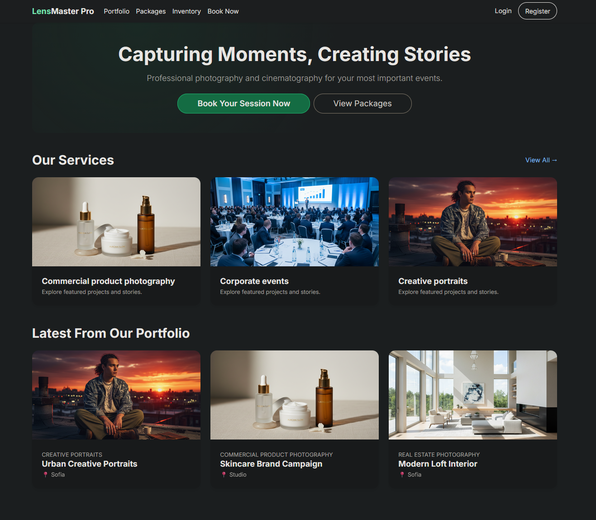
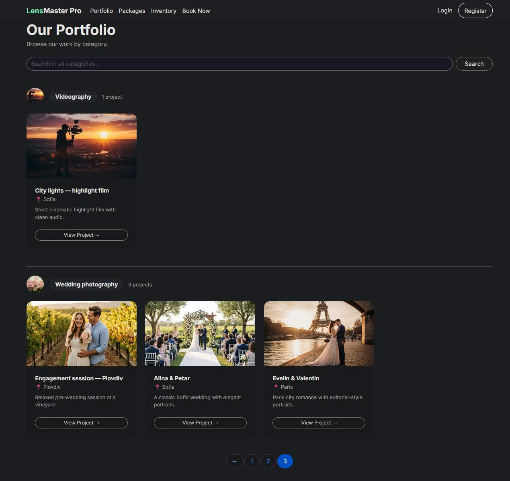
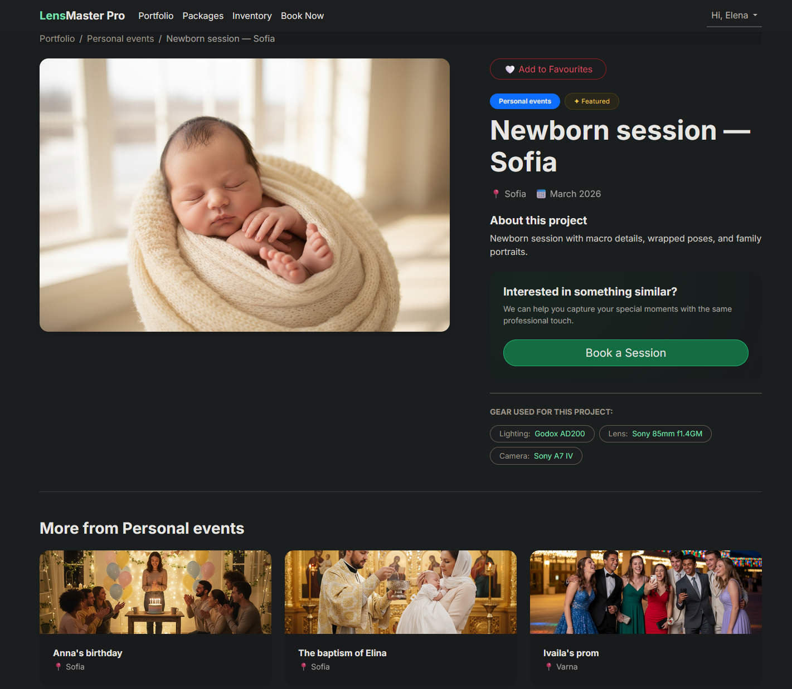
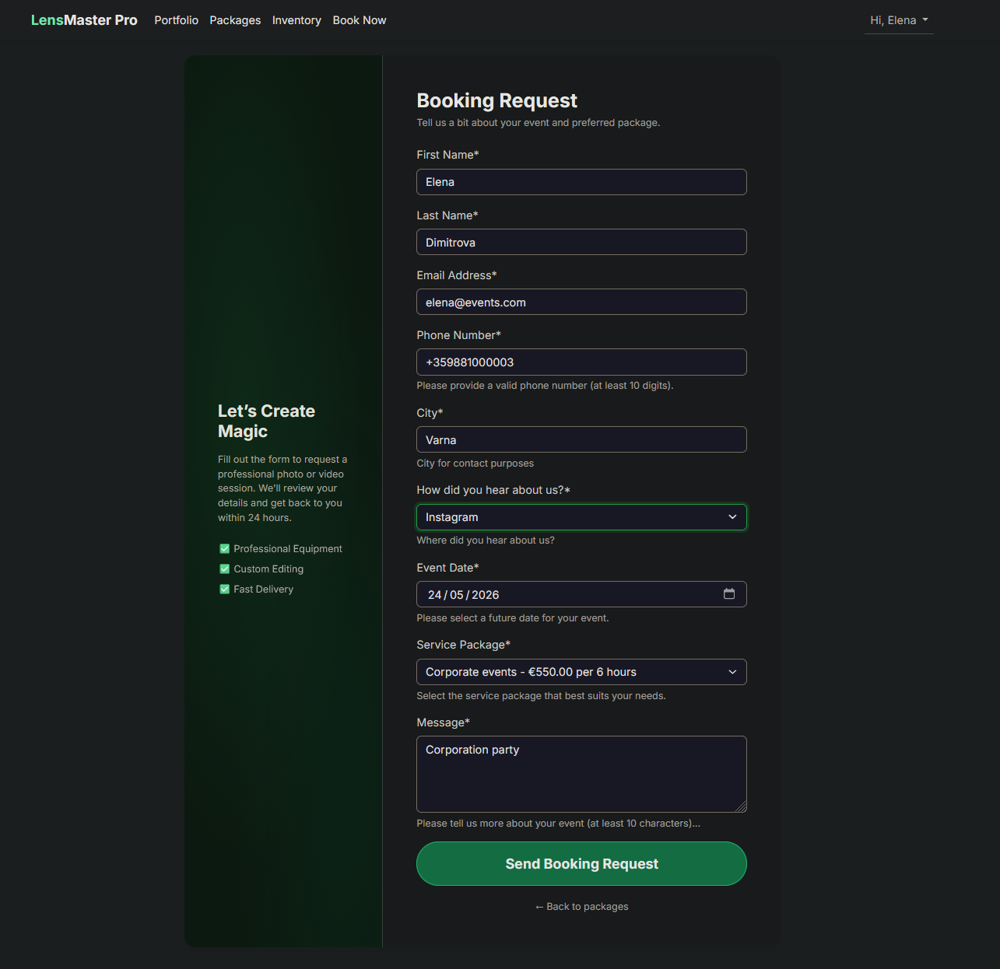
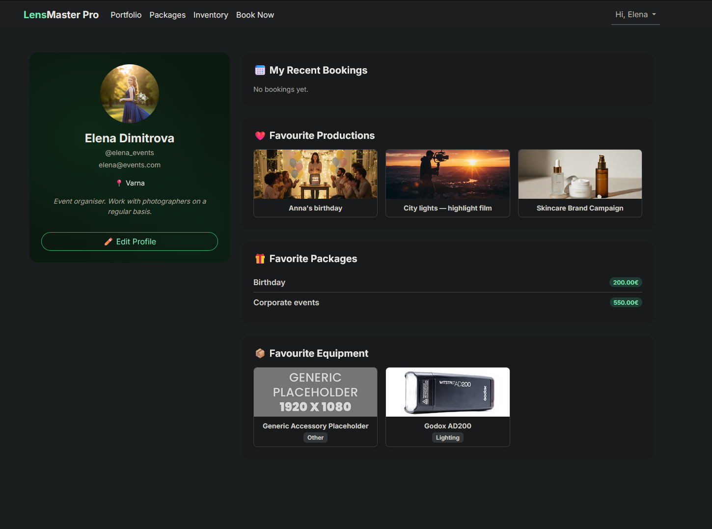
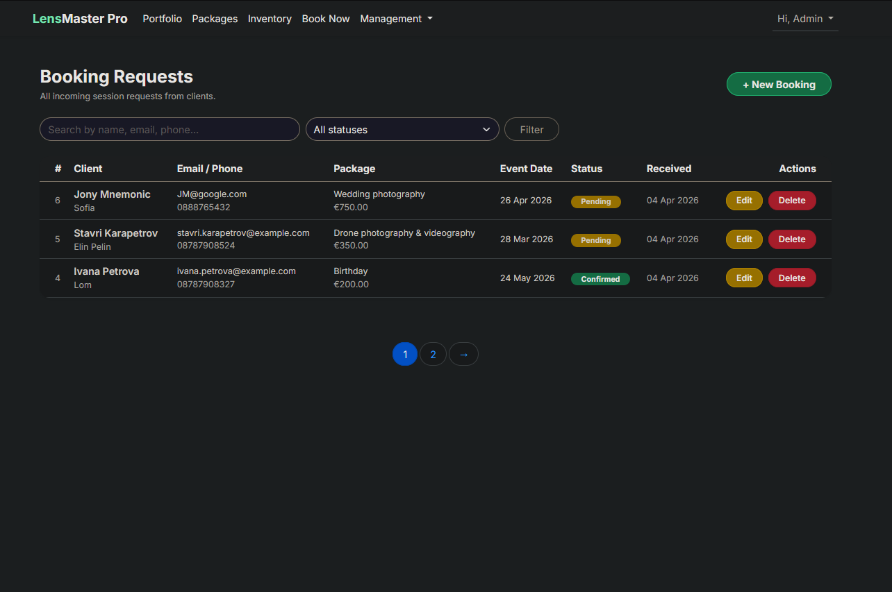
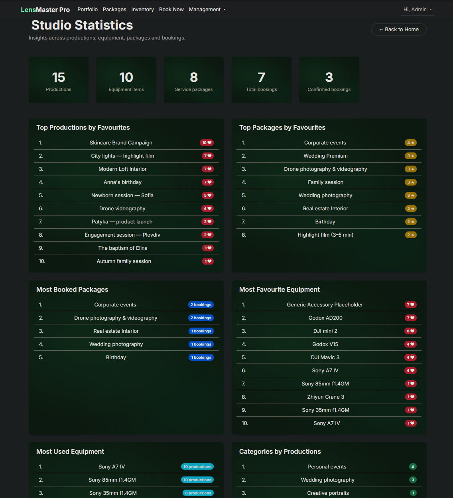
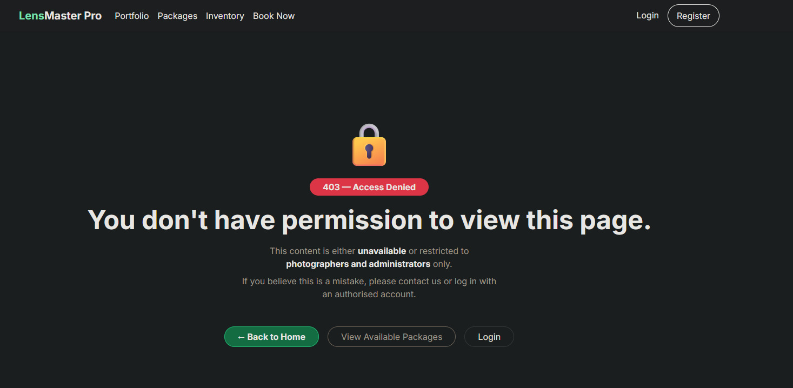

# 📷 LensMaster Pro


**LensMaster Pro** is a full-featured Django web application for professional photography and videography studios. It combines a curated portfolio showcase, service package management, client booking requests, studio equipment inventory, and a role-based access system — all wrapped in a polished dark-theme UI with green glow accents.

---

## 📌 Table of Contents
- [✨ Key Features](#-key-features)
- [🔐 Security & Permissions](#-security--permissions)
- [🏗️ Architecture Overview](#️-architecture-overview)
- [🧭 Site Map & Operations](#-site-map--operations)
- [🗂️ Directory Structure](#️-directory-structure)
- [🚀 Installation & Setup](#-installation--setup)
- [🌐 Live Demo](#-live-demo)
- [🖼️ Screenshots](#️-screenshots)
- [🧪 Data Management](#-data-management)
- [🔒 Custom 403 Page](#-custom-403-page)
- [🧩 Custom 404 Page](#-custom-404-page)
- [💥 Custom 500 Page](#-custom-500-page)
- [📊 Studio Statistics](#-studio-statistics)
- [⚙️ Async Tasks on Render — Django Q2](#️-async-tasks-on-render--django-q2)
- [☁️ Async Tasks on Azure — Celery & REST](#️-async-tasks-on-azure--celery--rest)
- [🗃️ Tech Stack](#️-tech-stack)
- [🧾 Project Notes](#-project-notes)

---

## ✨ Key Features

- **Multi-app Architecture**: Clean separation of concerns across `accounts`, `bookings`, `productions`, `inventory`, and `common`.
- **Role-Based Access Control**: Custom `PhotographerRequiredMixin` restricts all CRUD operations to the `Photographers` group. Regular users and anonymous visitors have read-only access. The owner (super user) have full access (staff management).
- **Full CRUD Functionality**: Complete management for **Productions**, **Categories**, **Service Packages**, and **Equipment** — all protected behind permission checks.
- **Dynamic Portfolio**: Categorized project showcase with detailed production pages, related items, search, and pagination.
- **Client Booking System**: Public booking request form with auto-fill from user profile, server-side validation, and status tracking.
- **Favorites System**: Logged-in users can favorite Productions, Equipment, and Service Packages — all visible on their profile page.
- **Inventory Tracking**: Professional equipment management with auto-generated `INV-XXXX` IDs, type-based filtering, and production linkage.
- **Studio Statistics Dashboard**: Photographer-only analytics page with top productions, most-booked packages, equipment usage, booking breakdowns by status and source.
- **Package Filtering**: Service packages grouped by category with dedicated per-category listing pages.
- **Cloudinary Integration**: Production image storage via Cloudinary in deployed environments; local filesystem in development.
- **Production Ready**: PostgreSQL, environment-based configuration, WhiteNoise static files, and custom 403, 404, and 500 error handling.

---

## 🔐 Security & Permissions

LensMaster Pro implements a layered security model:

| Layer | Implementation |
|---|---|
| **CSRF Protection** | Django default — all forms protected |
| **SQL Injection** | Django ORM — no raw queries |
| **XSS Protection** | Django template auto-escaping |
| **Clickjacking** | `X_FRAME_OPTIONS = 'DENY'` in production |
| **Secure Cookies** | `SESSION_COOKIE_SECURE` + `CSRF_COOKIE_SECURE` in production |
| **Content Sniffing** | `SECURE_CONTENT_TYPE_NOSNIFF` in production |
| **Authentication** | Django `LoginRequiredMixin` for user-specific views |
| **Authorization** | Custom `PhotographerRequiredMixin` for all write operations |
| **Stats Access** | `UserPassesTestMixin` — Photographers and superusers only |
| **Profile Isolation** | `get_object()` always returns `request.user.profile` — no URL spoofing |
| **Image Validation** | Server-side file type and size checks on all image uploads |

### Permission Matrix

| Action | Anonymous | Logged-in User | Photographer |
|---|---|---|---|
| Browse portfolio, packages, inventory | ✅ | ✅ | ✅ |
| Submit booking request | ✅ | ✅ (auto-fill) | ✅ |
| Favorite productions / equipment / packages | ❌ | ✅ | ✅ |
| View own profile & bookings | ❌ | ✅ | ✅ |
| Create / Edit / Delete any content | ❌ | ❌ | ✅ |
| View Studio Statistics | ❌ | ❌ | ✅ |
| Django Admin | ❌ | ❌ | ✅ (superuser) |

---

## 🏗️ Architecture Overview

- **`accounts/`**: Custom user model, registration/login/logout, profile management, and the Studio Statistics dashboard.
- **`productions/`**: Portfolio categories and project showcases — public browsing + full CRUD for Photographers.
- **`bookings/`**: Service packages (with per-category filtering) and client booking request flow with status management.
- **`inventory/`**: Studio equipment tracking with type-based filtering, production linkage, and full CRUD.
- **`common/`**: Shared abstract models (`TimestampedMixin`, `SlugMixin`, `ActiveStatusMixin`), `PhotographerRequiredMixin`, custom template tags, and global views (Home, 404).
- **`lensmaster_pro/`**: Core project configuration, URL routing, and custom static file storage.

---

## 🧭 Site Map & Operations

| Feature / Page | Exact URL Path | Access | Operations |
| :--- | :--- | :--- | :--- |
| **Home** | `/` | Public | View featured categories and latest work |
| **Portfolio Categories** | `/portfolio/categories/` | Public | Browse all categories |
| **Add Category** | `/portfolio/category/create/` | Photographer | Create new category with cover image |
| **Edit Category** | `/portfolio/category/<pk>/edit/` | Photographer | Edit existing category |
| **Delete Category** | `/portfolio/category/<pk>/delete/` | Photographer | Remove with confirmation |
| **Category Details** | `/portfolio/category/<slug>/` | Public | List productions with search & pagination |
| **Production Details** | `/portfolio/production/<slug>/` | Public | Full project view with related productions |
| **Add Production** | `/portfolio/add/` | Photographer | Create new production |
| **Edit Production** | `/portfolio/production/<slug>/edit/` | Photographer | Edit existing production |
| **Delete Production** | `/portfolio/production/<slug>/delete/` | Photographer | Remove with confirmation |
| **Service Packages** | `/bookings/packages/` | Public | Browse packages grouped by category |
| **Packages by Category** | `/bookings/packages/by_category/<id>/` | Public | Filter packages by service category |
| **Add / Edit / Delete Package** | `/bookings/packages/create/` etc. | Photographer | Full package CRUD |
| **Booking Request** | `/bookings/request/` | Public | Client intake form with auto-fill for logged-in users |
| **Booking List** | `/bookings/` | Photographer | Manage all bookings with search & status filter |
| **Edit / Delete Booking** | `/bookings/<pk>/edit/` etc. | Photographer | Update status, notes, date, package |
| **Inventory** | `/inventory/` | Public | Studio gear grouped by type |
| **Equipment by Type** | `/inventory/type/<type>/` | Public | Filter by Camera, Drone, Lens, etc. |
| **Equipment Detail** | `/inventory/<pk>/` | Public | Full equipment view with linked productions |
| **Add / Edit / Delete Equipment** | `/inventory/create/` etc. | Photographer | Full equipment CRUD |
| **Profile** | `/accounts/profile/` | Logged-in | View favorites, bookings, personal info |
| **Edit Profile** | `/accounts/profile/edit/` | Logged-in | Update personal info and avatar |
| **Studio Statistics** | `/accounts/stats/` | Photographer | Analytics dashboard |
| **Admin Panel** | `/admin/` | Superuser | Full database management |

---

## 🗂️ Directory Structure

```text
lensmaster_pro/
├── accounts/          # User auth, profiles, statistics dashboard
├── bookings/          # Service packages & client booking requests
├── productions/       # Portfolio categories & project showcases
├── inventory/         # Studio equipment & gear tracking
├── common/            # Shared abstract models, mixins & utilities
├── lensmaster_pro/    # Core project configuration (settings, urls, storage)
├── static/            # Global CSS, JavaScript, and images
└── templates/         # HTML templates organized by application module
```

---

## 🚀 Installation & Setup

### 1) Clone the repository
```bash
git clone https://github.com/AlAleksandrov/lensmaster_pro.git
cd lensmaster_pro
```

### 2) Environment Setup
```bash
# Create and activate virtual environment
python -m venv .venv

# Windows:
.venv\Scripts\activate
# macOS/Linux:
source .venv/bin/activate

# Install dependencies
pip install -r requirements.txt
```

### 3) Configuration
Create a `.env` file in the project root:
```env
SECRET_KEY=your-secret-key-here
DEBUG=True
ALLOWED_HOSTS=127.0.0.1,localhost

DB_ENGINE=django.db.backends.postgresql
DB_NAME=lensmaster_pro_db
DB_USER=postgres
DB_PASSWORD=your_password
DB_HOST=127.0.0.1
DB_PORT=5432
```

### 4) Initialize Database
```bash
python manage.py migrate
python manage.py createsuperuser
python manage.py runserver
```
Access the site at: **http://127.0.0.1:8000/**

### 5) Create the Photographers Group
The `Photographers` group is created automatically via a data migration (`0002_create_groups.py`). To assign a user:
```bash
python manage.py shell
>>> from django.contrib.auth import get_user_model
>>> from django.contrib.auth.models import Group
>>> User = get_user_model()
>>> user = User.objects.get(username='your_username')
>>> group = Group.objects.get(name='Photographers')
>>> user.groups.add(group)
```
Or simply assign the group from the Django Admin panel.

---

## 👤 Demo Users

To simplify evaluation, the project includes pre-configured users:

| Role | Username |
|---|---|
| 3 Photographers | alex_lens, maria_photo, ivan_shoot → group Photographers |
| 7 Regular Users | sofia_bride, peter_corp, elena_events, georgi_client, anna_wedding, nikola_biz, diana_art → group Clients |
| Password | Test1234! for all |

> Admin and Photographers has full CRUD + access to `/accounts/stats/`

---

## 🌐 Live Demo

- [Live Demo — Render](https://lensmaster-pro-2-0.onrender.com/)
- [Live Demo — Azure](https://lensmasterpro2-ghgmfnbbhfayfneh.spaincentral-01.azurewebsites.net/)

---

## 🖼️ Screenshots









---

## 🧪 Data Management

### Via the Site UI (recommended)
1. Register an account and assign it to the `Photographers` group via Admin.
2. Go to `/portfolio/categories/` → click **+ Add Category**.
3. Go to `/inventory/` → click **+ Add Equipment**.
4. Go to `/bookings/packages/` → click **+ Add Package**.
5. Go to `/portfolio/category/<slug>/` → click **+ Add New Production** inside a category.
6. Go to `/bookings/request/` to submit a booking as a client.

### Via Django Admin
1. Login at `/admin/`.
2. Add **Categories** first (required for Productions and Packages).
3. Add **Equipment** to the inventory.
4. Add **Service Packages**.
5. Add **Productions** linked to categories.
6. Manage **Booking Requests** and update their status.

---

## 🔒 Custom 403 Page
To test the access denied error handler, set `DEBUG=False` in your `.env`, go to Service package or Inventory list page like admin or photographer. Choose some package or equipment from the list, then in the package or equipment detail view page remember the number in url (<int:pk>) and click "Edit Package" button. Then uncheck Active and save changes. Visit anonymous (client) that route:
```
http://127.0.0.1:8000/bookings/packages/<int:pk>/

http://127.0.0.1:8000/inventory/<int:pk>/
```

---

## 🧩 Custom 404 Page
To test the custom error handler, set `DEBUG=False` in your `.env` and visit any non-existent URL:
```
http://127.0.0.1:8000/non-existent-page/
```

---

## 💥 Custom 500 Page
To test the internal server error handler, set `DEBUG=False` in your `.env`, temporarily add a "division by zero" or raise Exception in one of your views, and visit that route:
```
http://127.0.0.1:8000/route-with-error/
```

---

## 📊 Studio Statistics

The `/accounts/stats/` page is accessible only to Photographers and superusers. It provides:

- **Top Productions** by number of user favorites
- **Top Service Packages** by favorites and by booking count
- **Most Favourite Equipment** by user favorites
- **Most Used Equipment** by number of linked productions
- **Categories** ranked by production count
- **Bookings by Status** (pending / confirmed / cancelled)
- **Bookings by Source** (how clients heard about the studio)
- **KPI Cards**: total productions, equipment, packages, bookings, confirmed bookings

---

## ⚙️ Async Tasks on Render — Django Q2

When a photographer confirms a client booking request, the system needs to send a confirmation email without blocking the HTTP response. This is the primary use case for async task processing in LensMaster Pro — the view confirms the booking, enqueues the email task, and returns immediately, while the worker handles the actual sending in the background.

LensMaster Pro uses **[Django Q2](https://django-q2.readthedocs.io/)** for this on the **Render** deployment. Django Q2 is a native Django task queue that requires no external broker — it uses the existing **PostgreSQL** database as its backend, making it ideal for Render's free-tier environment where Redis is not available.

### How it works

```
HTTP Request → Django View → async_task() → ORM Broker (PostgreSQL)
                                                    ↓
                                           Django Q2 Cluster Worker
                                                    ↓
                                           Task executed in background
```

### Configuration (`settings.py`)

```python
Q_CLUSTER = {
    'name': 'lensmaster_orm',
    'workers': 2,
    'recycle': 500,
    'timeout': 60,
    'retry': 120,
    'queue_limit': 50,
    'bulk': 10,
    'orm': 'default',   # uses PostgreSQL — no Redis needed
}
```

### Starting the worker

```bash
python manage.py qcluster
```

> On Render, the worker runs as a separate **Background Worker** service defined in `render.yaml`, alongside the main web service.

### Example usage

```python
from django_q.tasks import async_task

# Fire-and-forget: send booking confirmation email in background
async_task('bookings.tasks.send_booking_confirmation', booking_id=booking.pk)
```

### Task monitoring

Scheduled and completed tasks are visible in the **Django Admin** under the `Django Q` section — no extra tooling required.

---

## ☁️ Async Tasks on Azure — Celery & Redis

The same use case applies on Azure — when a photographer confirms a booking request, the confirmation email must be sent asynchronously so the HTTP response is not held up by the mail server. A DRF endpoint receives the confirmation action, enqueues a Celery task, and returns `202 Accepted` immediately. The Celery worker then picks up the task from Redis and processes it independently.

On the **Azure** deployment, LensMaster Pro uses **[Celery](https://docs.celeryq.dev/)** with **Redis** as the message broker for this. The Django REST Framework (DRF) API exposes the endpoint that triggers the task, cleanly separating the confirmation action from the side-effect of sending the email.

### How it works

```
HTTP Request → Django View / DRF Endpoint
                        ↓
              task.delay() / task.apply_async()
                        ↓
              Redis (message broker)
                        ↓
              Celery Worker process
                        ↓
              Task executed (DB write, email, etc.)
```

### Installation

```bash
pip install celery redis django-celery-results
```

### Configuration

**`lensmaster_pro/celery.py`**
```python
import os
from celery import Celery

os.environ.setdefault('DJANGO_SETTINGS_MODULE', 'lensmaster_pro.settings')

app = Celery('lensmaster_pro')
app.config_from_object('django.conf:settings', namespace='CELERY')
app.autodiscover_tasks()
```

**`lensmaster_pro/__init__.py`**
```python
from .celery import app as celery_app

__all__ = ('celery_app',)
```

**`settings.py`**
```python
CELERY_BROKER_URL = os.environ.get('REDIS_URL', 'redis://localhost:6379/0')
CELERY_RESULT_BACKEND = 'django-db'   # stores results in PostgreSQL via django-celery-results
CELERY_ACCEPT_CONTENT = ['json']
CELERY_TASK_SERIALIZER = 'json'
CELERY_RESULT_SERIALIZER = 'json'
CELERY_TIMEZONE = 'Europe/Sofia'

INSTALLED_APPS += ['django_celery_results']
```

### Defining a task

```python
# bookings/tasks.py
from celery import shared_task
from django.core.mail import send_mail
from bookings.models import BookingRequest

@shared_task
def send_booking_confirmation(booking_id):
    booking = BookingRequest.objects.get(pk=booking_id)
    send_mail(
        subject='Booking Confirmed — LensMaster Pro',
        message=f'Hi {booking.first_name}, your session on {booking.preferred_date} is confirmed.',
        from_email='noreply@lensmasterpro.com',
        recipient_list=[booking.email],
    )
```

### Triggering from a DRF view

```python
# bookings/api/views.py
from rest_framework.views import APIView
from rest_framework.response import Response
from rest_framework import status
from bookings.tasks import send_booking_confirmation

class BookingConfirmView(APIView):
    def post(self, request, pk):
        send_booking_confirmation.delay(pk)   # enqueues task, returns immediately
        return Response({'status': 'queued'}, status=status.HTTP_202_ACCEPTED)
```

### Starting the worker

```bash
# Development
celery -A lensmaster_pro worker --loglevel=info

# Production (with concurrency)
celery -A lensmaster_pro worker --loglevel=warning --concurrency=2
```

### Azure deployment

On Azure, the Celery worker runs as a separate **Web Job** or second **App Service** instance pointing to the same Redis and PostgreSQL resources.

| Component | Azure Service |
|---|---|
| **Web App** | Azure App Service (Python 3.12) |
| **Celery Worker** | Azure App Service (separate slot) or Azure Container Instance |
| **Message Broker** | Azure Cache for Redis |
| **Result Backend** | Azure Database for PostgreSQL (via `django-celery-results`) |
| **Media Storage** | Cloudinary |

> Set `REDIS_URL` and all other secrets via **Azure App Service → Configuration → Application Settings** — never hardcode them.

---

## 🗃️ Tech Stack

| Layer | Technology |
|---|---|
| **Backend** | Django 6.0 (Python 3.14) |
| **Database** | PostgreSQL |
| **Forms** | `django-crispy-forms` with Bootstrap 5 |
| **Images** | Pillow + Cloudinary (production) |
| **Static Files** | WhiteNoise |
| **Environment** | `python-dotenv` |
| **Frontend** | Bootstrap 5.3 + Bootstrap Icons + Custom CSS (dark theme, green glow panels) |
| **Admin** | `django-unfold` (enhanced admin UI) |
| **Task Queue** | `django-q` + Celery & Redis |
| **API** | `djangorestframework` |
| **Deployment** | Render + Azure |

---

## 🧾 Project Notes

- **Git History**: Includes commits on multiple separate days as required.
- **Custom Template Tags**: `formatting` templatetag library with `|eur` (currency formatter) and `|hours_label` (pluralization) filters.
- **Pagination**: Implemented across Portfolio Categories, Productions by Category, Equipment list, Equipment by Type, Booking list, and Package list.
- **Slug Auto-generation**: Categories and Productions auto-generate slugs from their `name`/`title` on save via `SlugMixin`.
- **Equipment IDs**: Auto-generated internal inventory IDs in format `INV-XXXX` if not provided manually.
- **Image Validation**: Server-side validation for cover images (file type and size checks) on Category, Production, and Equipment forms.
- **Favorites**: M2M relationship between `Profile` and Productions / Equipment / Packages — toggle via POST with `LoginRequiredMixin`.
- **Booking Auto-fill**: `BookingCreateView` pre-fills first name, last name, email, phone, and city from the logged-in user's profile.
- **Data Migrations**: `0002_create_groups.py` automatically creates the `Photographers` group on first migrate.
- **License**: Educational project — Django Advanced Exam.
