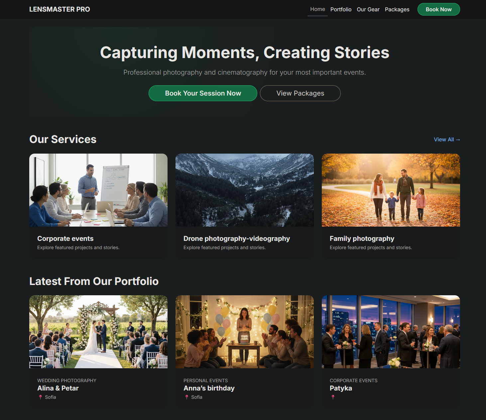
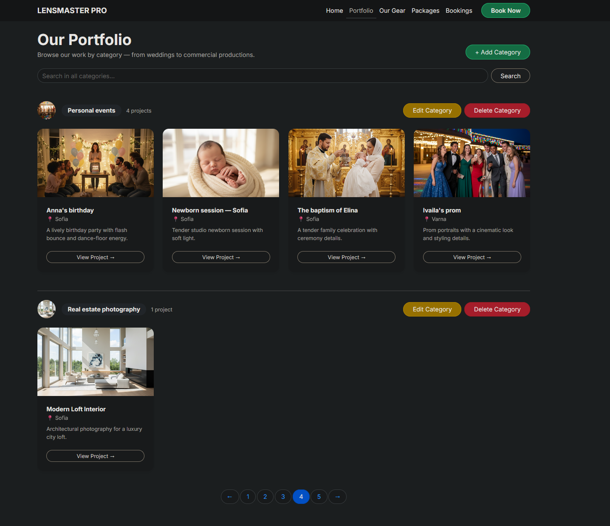
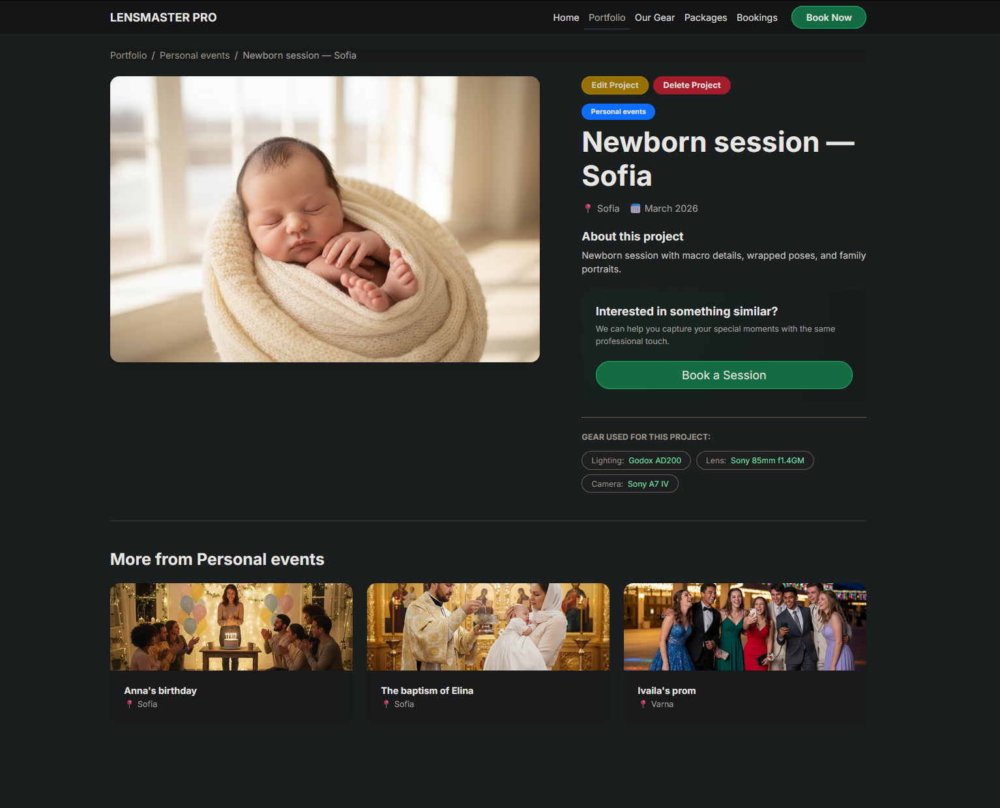

# 📷 LensMaster Pro


**LensMaster Pro** is a professional Django web application designed for photography and videography studios. It features a curated portfolio, service package management, client booking requests, and a studio equipment inventory system.

---

## 📌 Table of Contents
- [✨ Key Features](#-key-features)
- [🏗️ Architecture Overview](#️-architecture-overview)
- [🧭 Site Map & Operations](#-site-map--operations)
- [🗂️ Directory Structure](#️-directory-structure)
- [🚀 Installation & Setup](#-installation--setup)
- [🌐 Live Demo](#-live-demo)
- [🖼️ Screenshots](#️-screenshots)
- [🧪 Data Management](#-data-management)
- [🧩 Custom 404 Page](#-custom-404-page)
- [🗃️ Tech Stack](#️-tech-stack)

---

## ✨ Key Features
- **Multi-app Architecture**: Clean separation of concerns between Bookings, Productions, Inventory, and Common utilities.
- **Full CRUD Functionality**: Complete management systems for **Productions**, **Categories**, **Service Packages**, and **Equipment**.
- **Dynamic Portfolio**: Categorized project showcase with detailed production pages, related items, and pagination.
- **Client Booking System**: Integrated booking request forms with robust server-side validation.
- **Inventory Tracking**: Professional equipment management with auto-generated internal inventory IDs, filterable by equipment type.
- **Package Filtering**: Service packages grouped by category with dedicated per-category listing pages.
- **Production Ready**: PostgreSQL integration via environment variables and custom 404 error handling.

---

## 🏗️ Architecture Overview
- **`productions/`**: Portfolio categories and project showcases (Public browsing + Full CRUD for Categories and Productions).
- **`bookings/`**: Service packages management (with per-category filtering) and client booking request flow.
- **`inventory/`**: Studio equipment tracking with type-based filtering and Full CRUD.
- **`common/`**: Shared abstract models, mixins, and global views (Home, 404).
- **`lensmaster_pro/`**: Core project configuration and URL routing.

---

## 🧭 Site Map & Operations

| Feature / Page | Exact URL Path | Operations | Description |
| :--- | :--- | :--- | :--- |
| **Home** | `/` | View | Featured categories and latest studio work. |
| **Portfolio Categories** | `/portfolio/categories/` | View + **CRUD** | Browse all categories. Create, Edit, Delete categories. |
| **Add Category** | `/portfolio/category/create/` | Create | Create a new portfolio category with cover image. |
| **Edit Category** | `/portfolio/category/<pk>/edit/` | Update | Edit an existing category. |
| **Delete Category** | `/portfolio/category/<pk>/delete/` | Delete | Remove a category with confirmation. |
| **Category Details** | `/portfolio/category/<slug>/` | View | List productions within a specific category with pagination. |
| **Production Details** | `/portfolio/production/<slug>/` | View | Detailed view of a specific project with related productions. |
| **Add Production** | `/portfolio/add/` | Create | Create a new production item. |
| **Edit Production** | `/portfolio/production/<slug>/edit/` | Update | Edit an existing production. |
| **Delete Production** | `/portfolio/production/<slug>/delete/` | Delete | Remove a production with confirmation. |
| **Service Packages** | `/bookings/packages/` | **Full CRUD** | List and manage photography/video tiers grouped by category. |
| **Packages by Category** | `/bookings/packages/by_category/<id>/` | View | Filter and view packages within a specific service category. |
| **Booking Request** | `/bookings/request/` | Create | Client intake form with validation. |
| **Inventory** | `/inventory/` | View + **CRUD** | Studio gear grouped by type. Create, Edit, Delete equipment. |
| **Equipment by Type** | `/inventory/type/<type>/` | View | Filter inventory by equipment type (Camera, Drone, Lens, etc.). |
| **Equipment Detail** | `/inventory/<pk>/` | View | Detailed view of a specific equipment item. |
| **Admin Panel** | `/admin/` | All | Full database management for staff. |

---

## 🗂️ Directory Structure

```text
lensmaster_pro/
|-- bookings/          # Service packages & client booking requests
|-- productions/       # Portfolio categories & project showcases
|-- inventory/         # Studio equipment & gear tracking
|-- common/            # Shared abstract models, mixins & utilities
|-- lensmaster_pro/    # Core project configuration (settings, urls)
|-- static/            # Global CSS, JavaScript, and images
`-- templates/         # HTML templates organized by application module
```

---

## 🚀 Installation & Setup

### 1) Clone the repository
```bash
git clone https://github.com/AlAleksandrov/lensmaster_pro.git
cd lensmaster_pro
```

### 2) Environment Setup
```bash
# Create and activate virtual environment
python -m venv .venv

# Windows:
.venv\Scripts\activate
# macOS/Linux:
source .venv/bin/activate

# Install dependencies
pip install -r requirements.txt
```

### 3) Configuration
Create a `.env` file in the project root:
```env
SECRET_KEY=your-secret-key-here
DEBUG=True
ALLOWED_HOSTS=127.0.0.1,localhost

DB_ENGINE=django.db.backends.postgresql
DB_NAME=lensmaster_pro_db
DB_USER=postgres
DB_PASSWORD=your_password
DB_HOST=127.0.0.1
DB_PORT=5432

```

### 4) Initialize Database
```bash
python manage.py migrate
python manage.py createsuperuser
python manage.py runserver
```
Access the site at: **http://127.0.0.1:8000/**

---

## 🌐 Live Demo
A temporary live demo will be available here:
- [Live Demo Link ngrok](https://rosella-unshotted-adjustably.ngrok-free.dev/)

- [Live Demo Link Render](https://lensmaster-pro.onrender.com/)

- [Live Demo Link Azure](https://lensmasterpro-apckfyhscgf5dsbq.spaincentral-01.azurewebsites.net/)

---

## 🖼️ Screenshots




---

## 🧪 Data Management
Authentication for the public site is intentionally excluded per exam requirements. You can manage content directly from the site UI or via the Django Admin:

### Via the Site UI (recommended in this way)
1. Go to `/portfolio/categories/` → click **+ Add Category**.
2. Go to `/inventory/` → click **+ Add Equipment**.
3. Go to `/bookings/packages/` → click **+ Add Package**.
4. Go to `/bookings/` → click **+ New Booking**.
5. Go to `/portfolio/by_category/name-of-category/` → click **+ Add New Production** inside a category.

### Via Django Admin
1. Login at `/admin/`.
2. Add **Categories** first.
3. Add **Equipment** to the inventory.
4. Add **Service Packages**.
5. Add **Booking request**.
6. Add **Productions**.

---

## 🧩 Custom 404 Page
To test the custom error handler, set `DEBUG=False` in your `.env` and visit:
- `http://127.0.0.1:8000/non-existent-page/`

---

## 🗃️ Tech Stack
- **Backend**: Django 6.0 (Python 3.14)
- **Database**: PostgreSQL
- **Forms**: `django-crispy-forms` with Bootstrap 5
- **Environment**: `python-dotenv`
- **Images**: Pillow
- **Frontend**: Bootstrap 5.3 + Bootstrap Icons + Custom CSS (dark theme with green glow panels)
- **Deployment**: Render (production) + ngrok (local tunneling)

---

## 🧾 Project Notes
- **Git History**: Includes commits on multiple separate days as required.
- **Custom Template Tags**: `formatting` templatetag library with `|eur` (currency) and `|hours_label` filters.
- **Pagination**: Implemented across Portfolio Categories, Productions by Category, and Equipment by Type pages.
- **Slug Auto-generation**: Categories and Productions auto-generate slugs from their name/title on save.
- **Equipment IDs**: Auto-generated internal inventory IDs in format `INV-XXXXXXXX` if not provided.
- **Image Validation**: Server-side validation for cover images (type and size checks) on both Category and Production forms.
- **License**: Educational project for the Django Basics Exam.